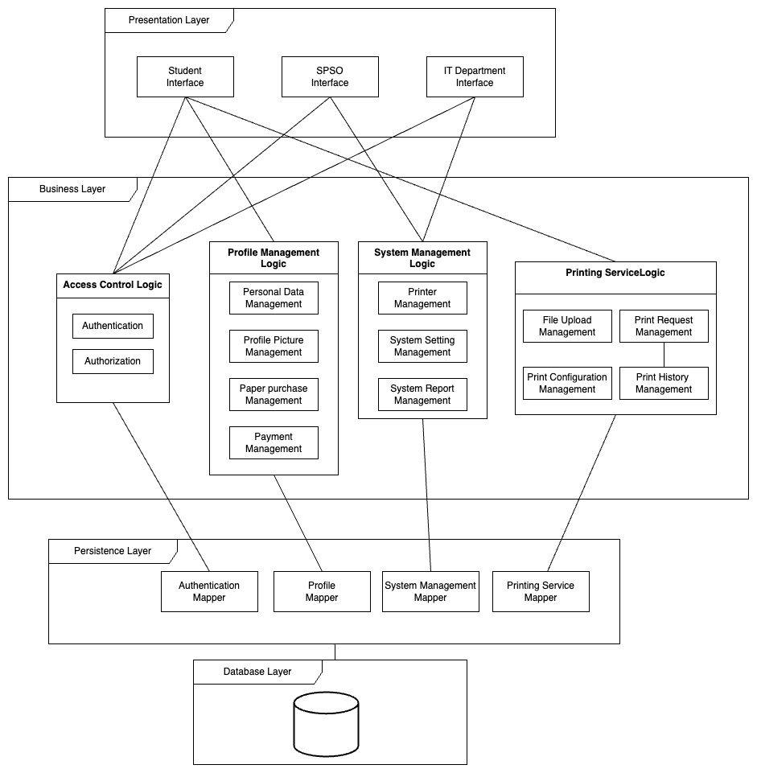
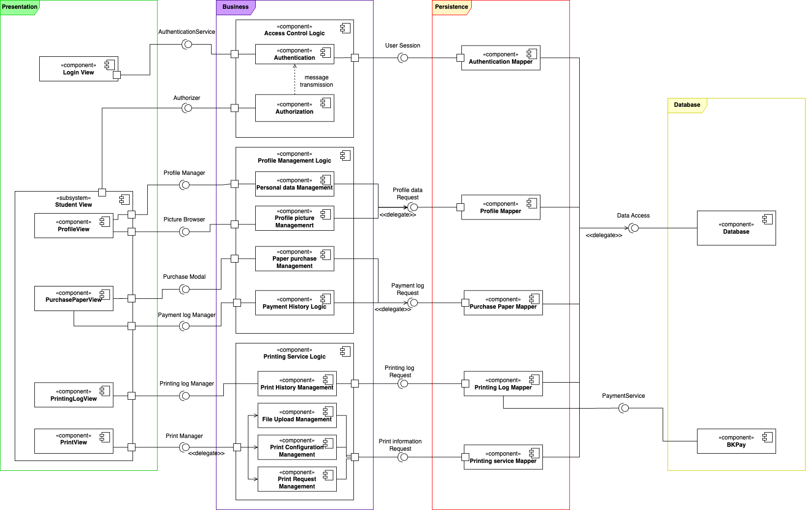

# Architecture

## Table of contents
- [Architecture](#architecture)
  - [Table of contents](#table-of-contents)
  - [Layered Architecture](#layered-architecture)
    - [Designing Layered Architecture](#designing-layered-architecture)
    - [Presentation Strategy](#presentation-strategy)
    - [Data Storage Approach](#data-storage-approach)
    - [External services/API](#external-servicesapi)
  - [Component Diagram](#component-diagram)
  - [Presentation Layer](#presentation-layer)
    - [Business Layer](#business-layer)
    - [Persistence layer](#persistence-layer)
    - [Database layer](#database-layer)

## Layered Architecture

### Designing Layered Architecture

<picture>
  <source media="(prefers-color-scheme: dark)" srcset="images/Layered.png">
  
</picture>

### Presentation Strategy

&nbsp;&nbsp;&nbsp;&nbsp;&nbsp;&nbsp;According to the requirement, HCMUT-SPSS operates on the desktop browser. The user interface design and implementation should compensate for the unique features of the web environment, which includes wider screen size and user’s mouse/touchpad interactions. Also, the style of the system should follow the typical CRM dashboard design and layout. \
&nbsp;&nbsp;&nbsp;&nbsp;&nbsp;&nbsp;Design system rules, colors scheme and components should be defined. Rules of the design should be straightforward, every measuring should be divisible by 4, and every border radius should be exactly 8 px. Secondly, users should be able to perform two main sequences: Print File Sequence and Manage Profile Sequence. Aside from these main sequences, users also should be able to perform Authentication and View History sequences. Based on the interaction of users with the system, we defined the views of the HCMUT-SPSS system as follows:
- Login Page: Manage the Authentication flow. This is the default page of an unauthenticated user when entering the system.
- Home Page: Display vital information such as number of prints, number of paper left. This is the default page of an authenticated user when entering the system.
- Printing History Page: Allow users to view all the past print requests. This page should also display the status of each request.
- Print Page: Display the flow to create a new print request. This page shows the preview of the documents and equivalent settings.
- Paper Purchase Page: Allow users to view the number of papers they have left. This page should also allow them to purchase more paper. 
- Profile Page: Allow users to view their current profile, including name and email.

\
&nbsp;&nbsp;&nbsp;&nbsp;&nbsp;&nbsp;Each view’s layout should be defined by the actions of the users on that page. For an CRM dashboard style, each page should contain a side menu, which helps for navigating between views. Moreover, since the main action of the user when entering the web is to print a page, an add printing request button is added to the side menu. To better represent the general view, here is a general view of the user interface:

<picture>
  <source media="(prefers-color-scheme: dark)" srcset="images/Presentation.png">
  
</picture>

To see a fully featured user flow of the user interface, visit our System Modeling.

### Data Storage Approach

We will use MySQL for the HCMUT_SSPS system. MySQL is a user-friendly SQL database that is known for its high scalability, performance, and flexibility. It is a popular choice for beginners due to its ease of use and familiarity. Also, MySQL's document-oriented data model accommodates unstructured data with its flexible schema, making it a suitable option for systems with evolving data requirements. Moreover, MySQL's native replication and sharding capabilities allow the system to scale horizontally as the number of data increases, ensuring high availability and fault tolerance.  

### External services/API

According to the requirement, our system has to work with the university’s authentication system. It uses the Central Authentication Service (CAS) protocol to provide single sign-on (SSO) service. Therefore we have to follow the protocols of the HCMUT_SSO service to work with it to authenticate and retrieve student accounts for our application to work correctly. In detail, it is supposed to work as follow: (because there is no clear documentation for the HCMUT_CAS, we assume it is the “CAS Server” and our application is one of the two “Protected apps” in the diagram)

<picture>
  <source media="(prefers-color-scheme: dark)" srcset="images/CAS.png">
  
</picture>

## Component Diagram

Below is the link to access our component diagram for a better view: [https://drive.google.com/file/d/1bvfRA24oWaZeEupZVPPd9k5k_P8v7nrg/view?usp=sharing](https://drive.google.com/file/d/1bvfRA24oWaZeEupZVPPd9k5k_P8v7nrg/view?usp=sharing)

<picture>
  <source media="(prefers-color-scheme: dark)" srcset="images/Component.png">
  
</picture>

The diagram depicts the interactions between different components in the Printing service module (Students’ side). The system revolves around 4 layers that are described in layered architecture part.

## Presentation Layer
- **Login View**: Render the Account authentication interface from component Account Logic (internal component Authentication)
- **Student View**: 
  - **Profile View**: Render profile information obtained from Profile logic component and can be used for uploading profile image.
  - **Printing Log View**: Render printing log information obtained from Printing Log Logic component and can cancel printing process on waiting.
  - **Purchase Paper View**: Render payment log information obtained from Purchase Paper Logic component as well as a button to purchase paper. 
  - **Print View**: Render printing window for printing process through Printing Service Logic component. 

### Business Layer
Consists of 5 major components representing 5 modules of the Business layer we have discussed earlier in layered architecture.
- **Authentication Logic**: Login, logout, retrieve account session.
- **Profile Logic**: View profile and upload image.
- **Printing Log Logic**: View printing log and cancel print.
- **Purchase Paper Logic**: Purchase paper and display payment log.
- **Printing Service Logic**: Functions for students to print file 

### Persistence layer
There are 5 data mapper:
- **Authentication Mapper**: Mapping authentication service from Authentication Logic to database. 
- **Profile Mapper**: Mapping profile information from Profile Logic to database
Printing Log Mapper: Mapping printing log information from Printing Log Logic to database.
- **Purchase Paper Mapper**: Mapping payment data from Purchase Paper Logic to BKPay and updating paper balance to database. 
- **Printing Service Mapper**: Mapping printing information from Printing Service Logic to database. 

### Database layer
Consists of a database module providing data to each data mapper in the Persistence layer. There is also the BKPay service to retrieve data about payment logs. 
