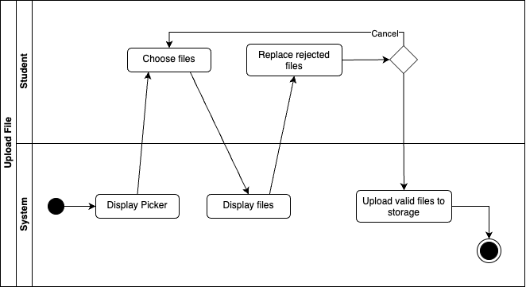
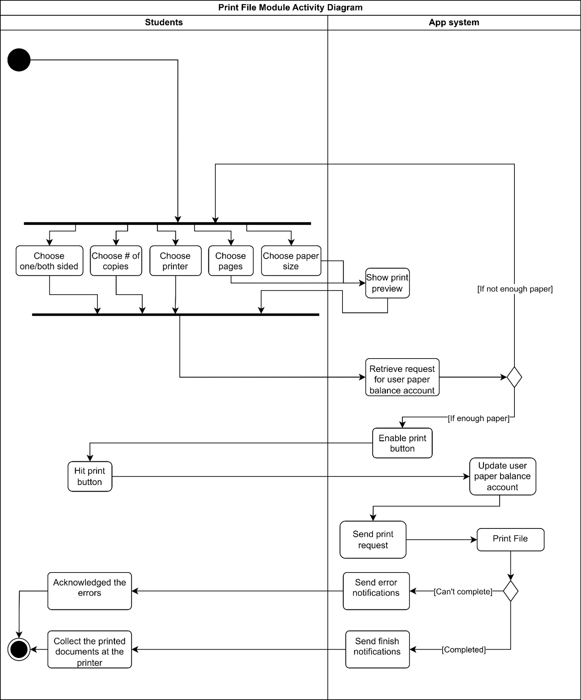
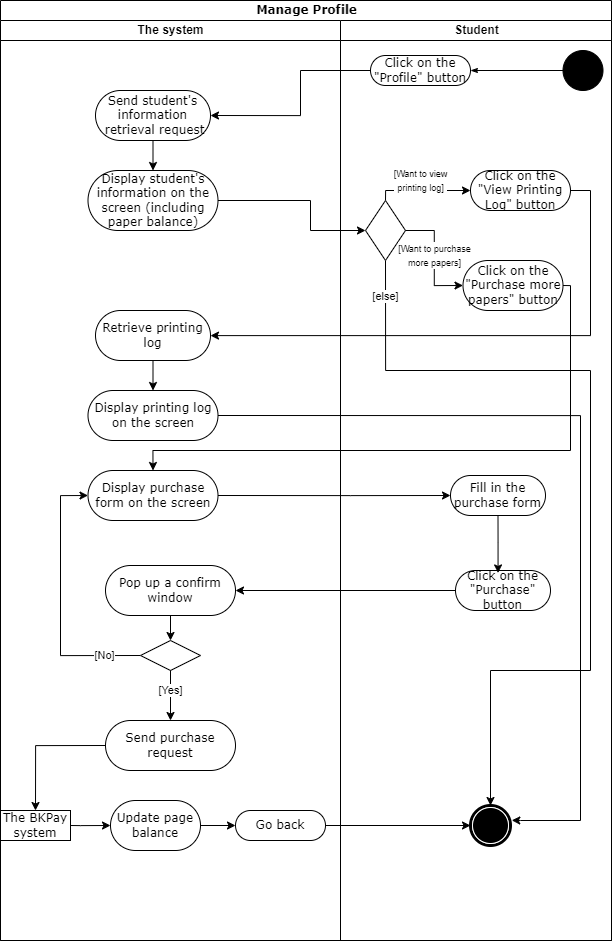
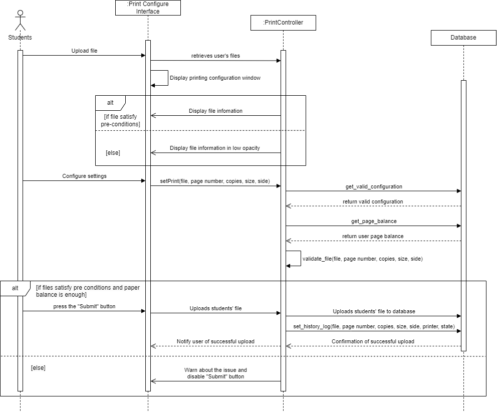
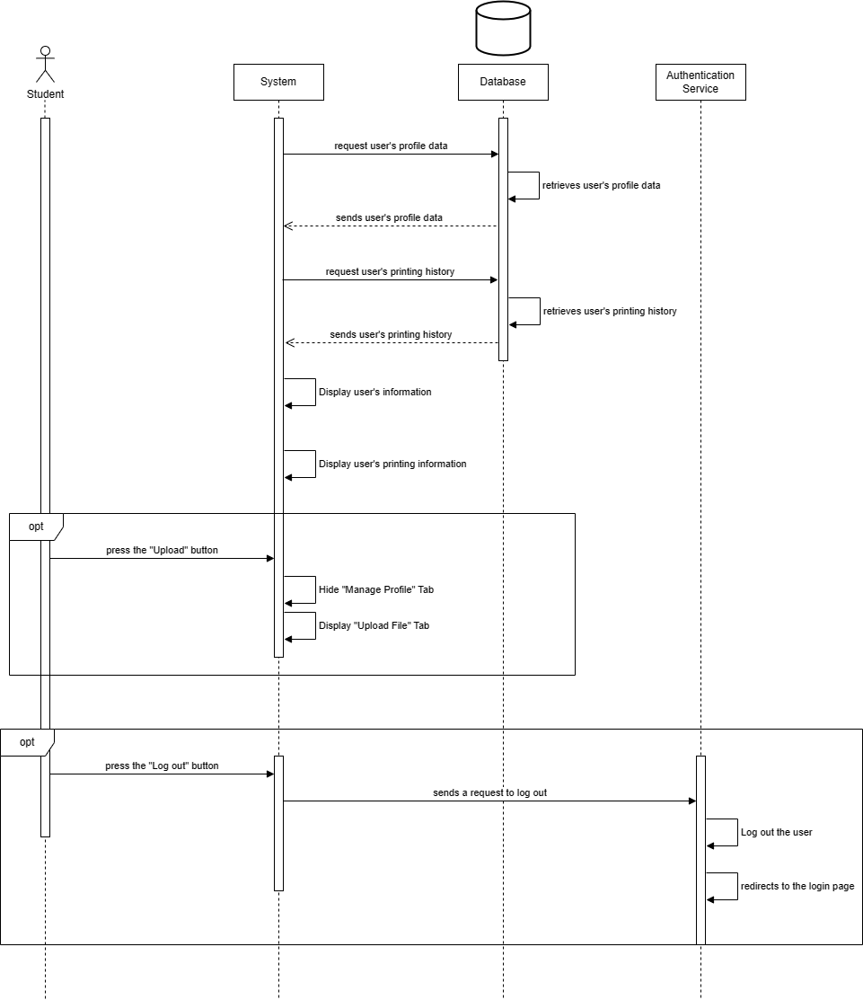
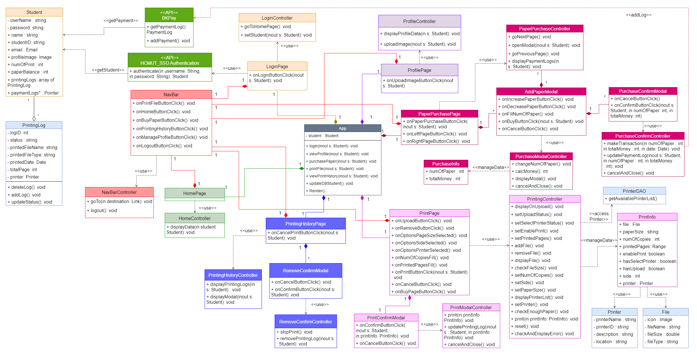

# System Modeling

## Table of contents
- [System Modeling](#system-modeling)
  - [Table of contents](#table-of-contents)
  - [Activity Diagrams](#activity-diagrams)
    - [Upload file activity](#upload-file-activity)
    - [Print file activity](#print-file-activity)
    - [Manage profile activity](#manage-profile-activity)
  - [Sequence diagram](#sequence-diagram)
    - [Print File sequence](#print-file-sequence)
    - [Manage Profile sequence](#manage-profile-sequence)
  - [Class Diagrams](#class-diagrams)
    - [Model:](#model)
    - [View](#view)
    - [Controller](#controller)
  - [User Interface](#user-interface)

## Activity Diagrams

### Upload file activity

<picture>
  <source media="(prefers-color-scheme: dark)" srcset="images/UploadFileActivity.png">
  
</picture>

### Print file activity

<picture>
  <source media="(prefers-color-scheme: dark)" srcset="images/PrintFileActivity.png">
  
</picture>

### Manage profile activity

<picture>
  <source media="(prefers-color-scheme: dark)" srcset="images/ManagePrintActivity.png">
  
</picture>

## Sequence diagram

### Print File sequence

<picture>
  <source media="(prefers-color-scheme: dark)" srcset="images/PrintFileSequence.png">
  
</picture>

**Describe text:** 
Users should have already successfully loaded the file onto the system before they begin formatting their print page. During the formatting process, they can choose various options, including selecting one or both sides for printing, specifying the number of copies, defining the page range, setting the paper size, and choosing the printer for the task. To assist users in visualizing the effects of these formatting choices, a print preview is displayed adjacent to the formatting panel. The system actively calculates the number of sheets required for the print request. If users lack the necessary amount of paper in their account balance, the "Print" button will be disabled. Once users are content with the settings and have sufficient paper, they can initiate the printing process by clicking the "Print" button, which will send a print request to the designated printer. The printer will proceed to execute the request. In the event of any issues preventing the printer from completing the task, the system will promptly notify the users. However, if the printing process proceeds without issues, the system will provide a successful status update, allowing users to collect their printed documents from the designated printer.

### Manage Profile sequence

<picture>
  <source media="(prefers-color-scheme: dark)" srcset="images/ManageFileSequence.png">
  
</picture>

If the students want to see their private information, they click on the “Xem hồ sơ” button. The system will retrieve the data from the database and display it on the screen. If they want to view their printing history (printing log), they will click on the “Lịch sử in” button. The system then retrieves the data from the database and displays it on the screen, then if they want to cancel a specific pending prin, they can click on the icon to do so. If the students want to purchase more papers, they can click on the “Mua giấy” button. The system will display a form for them to fill in the amount of papers they want to buy and calculate the price. When the students finish and click on the purchase button, the system will confirm it again by popping a modal. If it is confirmed, the system will go on and send the request to the BKPay system and update the students’ paper balance in the database.

## Class Diagrams

<picture>
  <source media="(prefers-color-scheme: dark)" srcset="images/Class.png">
  
</picture>

Link to the diagram: [https://drive.google.com/file/d/1OzDlh1OW187bjPJeWAp5MGmVrvmTqfBw/view?usp=sharing](https://drive.google.com/file/d/1OzDlh1OW187bjPJeWAp5MGmVrvmTqfBw/view?usp=sharing)

Our group’s class diagram is drawn based on the **MVC model**:

### Model:
The Model contains the pure application data and pure logic describing how to present the data to a user. (It’s just data that is shipped across the application like for example from back-end server view and from front-end view to the database.)

- **Student**: contains information of the user. Here we use public attributes for easy access. Only username and password are private for security reasons.
  - Payment Log is a pointer to payment log objects that will be retrieved from BKPay. Here we store the logs as a linked list.
- **Printing Log**: contains information about the printing log that will be displayed on the printing history page and the method to update log data. 
- **Printer**: contains information about printers for user to choose. 
- **File**: contains information about the file that is uploaded by user. 
- **PrintInfo**: contains information about the print information, categorized into: File uploading, Print properties, Printer selection.
- **PurchaseInfo**: contains information about purchase information including number of paper purchased and total money that user needs to pay.  

### View
The View presents the model’s data to the user. The view knows how to access the model’s data, but it does not know what this data means or what the user can do to manipulate it. View just represents, displays the application’s data on screen. 

- **NavBar**: contains buttons to navigate between pages. 
- **Login Page**: if user is logged out, this is the default page which demands the user to login first before using the application’s function by clicking the login button. 
- **Home Page**: page after user logins, show summary information of the user. 
- **Print Page**: contains necessary buttons for file printing, including buttons for uploading files, specifying printing properties, selecting available printers. 
  - onRemoveButtonClick(): this function is used to remove uploaded files together with other chosen properties, go back to upload file. 
  - onPrintButtonClick(inout s: Student): after this button is clicked, printing information is sent to confirm modal. 
- **Print Confirm Modal**: pop up modal used to confirm print. 
  - onConfirmButtonClick(inout s: Student, in printInfo: PrintInfo): after confirmation, printInfo will be sent to the corresponding printer for printing.
  - onCancelButtonClick(): cancel the printing, go back to upload file. 
- **Profile Page**: show user profile and a button to upload image. 
- **Paper Purchase Page**: show payment log retrieved from BKPay and a button onPaperPurchaseButtonClick() for starting paper purchase.
- **Add Paper Modal**: Paper purchase process starts here. This is the view used for choosing the number of papers that user wants to purchase. 
  - onBuyButtonClick(inout s: Student): purchasing data sent to purchase confirm modal. 
  - onCancelButtonClick(): cancel purchasing paper process, back to paper purchase page. 
- **Purchase Confirm Modal**: for confirming or canceling the purchase processes. System will only update data upon user’s confirmation. 

### Controller
The Controller exists between the view and the model. It listens to events triggered by the view (or another external source) and executes the appropriate reaction to these events. 

- **NavBar Controller**
  - goTo(in destination: Link): contains the logic to navigate between the pages 
  - logout(): end user session. 
- **Login Controller**
  - goToHomePage(): navigate to home page after successful login.
  - setStudent(inout s: Student): function to pass the retrieved Student object from database to current Student that will be used throughout the user session. 
- **Home Controller**
  - displayData(in student: Student): contains the logic to call out some important data in Student object.
- **Print Controller** contains the logic that receives the user input to prepare for printing, including functions for uploading file, specifying properties, selecting printers.
  - displayOnUpload(): after uploading file, change the display
  - setUploadStatus() + setSelectPrinterStatus(): after uploading and select printer, enable print button via setEnablePrinter()
  - checkAndDisplayError(): check for file and paper balance constraint and display error. 
  - print(in printInfo: PrintInfo): sending data to Print Confirm Modal for next step. 
- **Print Modal Controller**
  - print(in printInfo: PrintInfo): contains the logic to use the print information to print out the file 
  - updatePrintingLog(inout s: Student, in printInfo: PrintInfo): contains the logic to update printing log in Student object. 
- **Profile Controller**: 
  - displayProfileData(in s: Student): contains the logic to display profile information in Student 
  - uploadImage(inout s: Student): contains the logic to upload and update the profile image. 
- **Paper Purchase Controller**
  - displayPaymentLogs(in s: Student): contains the logic to display payment logs in Student 
  - openModal(inout s: Student): contains the logic to open the Modal for purchasing paper. 
- **Purchase Modal Controller**: all functions needed to choose the number of papers to purchase and calculate total money. 
- **Purchase Confirm Controller**: on user confirmation
  - makeTransaction(): function to make transactions 
  - updatePaymentLog(): send data to update payment log in BKPay. 

Beside that, the class diagram contains **2 external API**:
- **HCMUT_SSO**: authentication service of HCMUT, used for checking authentication.
- **BKPay**: payment service of HCMUT, used for making payments. 

Lastly, there is a central system class that will be the one that calls the functions in other pages and renders the application, called “App”. The Student object in the current user session will be passed throughout the system using this class. 

## User Interface

Link to our [Figma Design](https://www.figma.com/proto/twF6vP0we7rCndNYyn77Op/SWE-UI?page-id=0%3A1&type=design&node-id=142-9161&viewport=298%2C-1176%2C0.2&t=VhJA3IqnVcpKhiDe-9&scaling=contain&starting-point-node-id=142%3A9161&show-proto-sidebar=1&fbclid=IwAR13kx2AdGe1eKS17S4rkH9KKbrsoAYjgpkBMB7JwTHRkvMKkilLjJQHV1Y)
