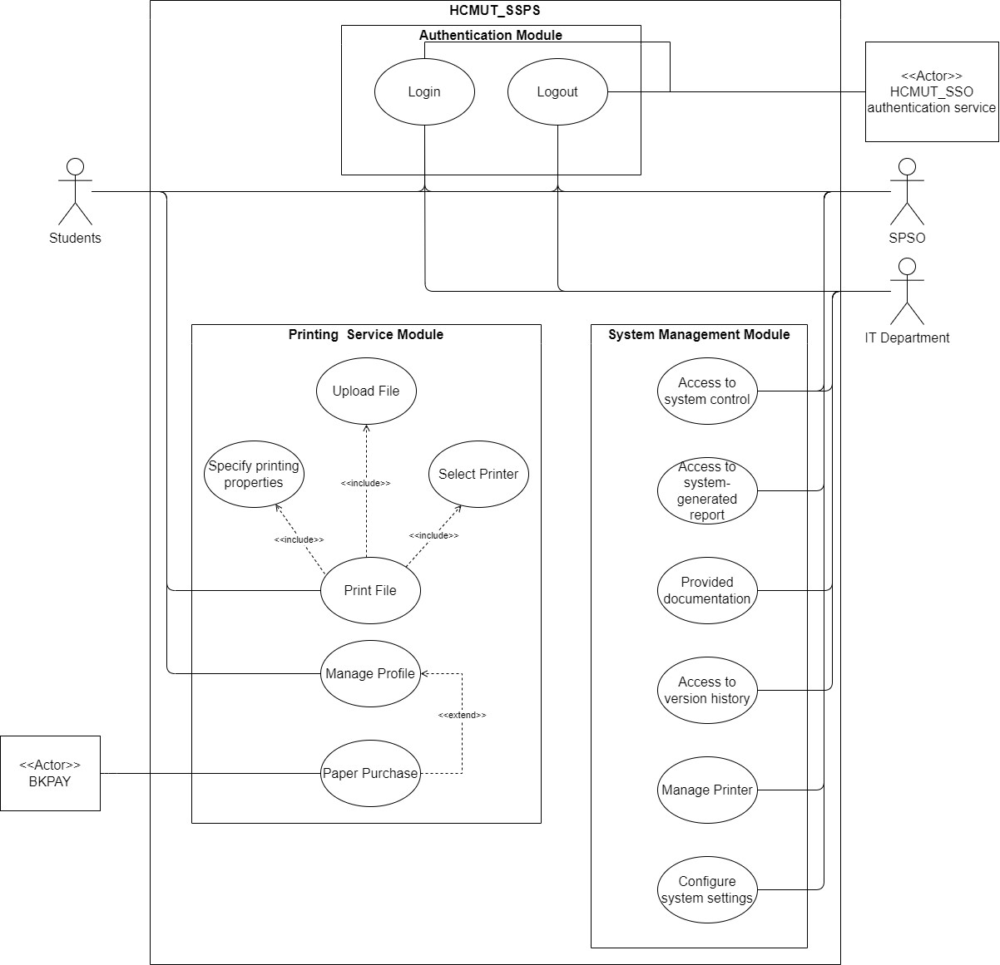
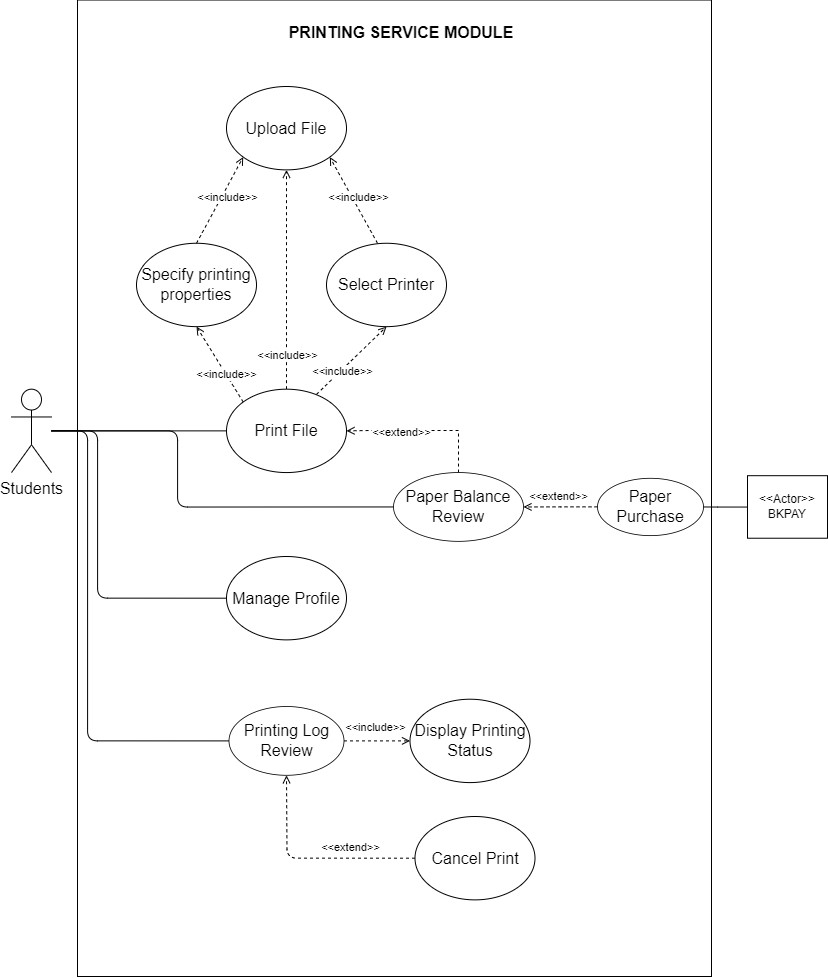

# Requirement

## Table of contents
- [Requirement](#requirement)
  - [Table of contents](#table-of-contents)
  - [Domain Context](#domain-context)
  - [Stakeholders](#stakeholders)
  - [Functional Requirement](#functional-requirement)
  - [Non-functional Requirement](#non-functional-requirement)
  - [Use-case diagram](#use-case-diagram)
    - [System](#system)
    - [Main module](#main-module)

## Domain Context

Ho Chi Minh University of Technology is planning to implement a Student Smart Printing Service (HCMUT_SSPS), which can help students to print documents on the university campus. To be more precise, printers are set up at several places inside the university campus, ready for students to print documents. The deployment of this project meets the demand of printing from the students, providing overall a better learning environment, and helping students access to an immediate low-cost printing service. However, the operation of the service can become sophisticated when numerous students seek to utilize it. Furthermore, there are various printers across the campus to manage and it can be intractable for the managers of SSPS to maintain the availability of every printer. The SSPS, which is expected to significantly cut down the time to operate and control the service, will streamline the printing service at the university, ultimately improving efficiency and reducing expenses for both students and the university.

## Stakeholders 

- Student: The software enables file uploads, printing customization, and job submission. It simplifies registration, offers a user-friendly interface, and allows scheduled document retrieval, saving time. The software also displays printing history and remaining paper count for user convenience.

- SPSO: The system benefits the SPSO by simplifying service management and providing usage records through logs. This enables easy access to statistics, allowing the SPSO to assess the service's effectiveness. Analyzing these statistics helps in making policy changes to attract more students if the service uptake is low.

- IT Department: The system benefits the IT department by identifying and displaying errors for prompt resolution. It provides a detailed document, enabling the IT staff to understand the system's structure and operation. This documentation empowers the IT department to make system changes independently without reliance on the original developers.

## Functional Requirement

- Students 
  - Students must be able to login into their account after entering the correct username and password via HCMUT_SSO authentication service.
  - Students must be able to upload document files to HCMUT_SSPS.
  - Students must have the option to select a printer from the available choices across campuses.
  - Students must be able to specify printing properties, including paper size (A3, A4), single/double-sided printing, number of copies, and page range for their documents using the provided user interface.
  - Students can also track the status of their printing job, to know whether their print requests have been successfully sent or not (successful or failed), which stage the printing jobs are in (queuing, printing) by using status such as: SUCCESS, FAIL, PENDING, PRINTING, FINISH,...
  - Students must have access to a printing history log that displays details such as customer ID, printer ID, files’ name, date time, and the number of pages printed.
  - Students should have the capability to purchase additional printing pages using the "Buy Printing Pages" feature within the system and make payments through an online payment system. 
- Student Printing Service Officer (SPSO)
  - The SPSO must be able to login into their account after entering the correct username and password via HCMUT_SSO authentication service.
  - The SPSO must be able to view the printing history (log) of all students, including student ID, printer ID, file name, date time, and number of pages, for a specified time period (date to date) and for all or selected printers.
  - The SPSO must be able to view the payment history (log) of all students, including student ID, number of pages bought, and during a specified time period (date to date).
  - The SPSO should have the capability to manage printers, including adding new printers, enabling/disabling existing printers, and updating printer information such as brand/manufacturer name, printer model, short description, and location.
  - The SPSO should have the authority to configure various system settings, including changing the default number of pages allocated to students for printing each semester, specifying the dates when the default number of pages is allocated, and defining the permitted file types accepted by the system.
  - The SPSO should have access to the reports of the use of the printing system at any time, which are generated automatically at the end of each month and each year and are stored in the system
- IT Department
  - The IT staff needs to be provided with a comprehensive documentation, such as the description and structure of the code, a guide about how to read the system-generated reports, enabling effective system maintenance and upgrades during later reviews.
  - New IT staff should have access to a version history or changelog of the system updates, allow them to review past changes and updates to the printing service, aiding in understanding its evolution.
  - The IT staff should be promptly notified of any errors, including paper shortages, ink issues, or system malfunctions, occurring in the system.

## Non-functional Requirement
  - At the beginning of students’ first semester, students will receive a personal account through HCMUT_SSO authentication service via email , which is required for using the printing service.
  - The SPSO must log in the system via HCMUT_SSO authentication service before controlling the system and log out of the system after work.
  - The system only allows students to upload single or multiple files from devices in only predetermined types (PDF, doc, docx) with a maximum of 25 MB in size.
  - The system only allow a student to print some number of pages when it does not exceed his/her account (page) balance
  - The system should use printers that have fast printing speed, at the minimum of 30 pages/min so students do not have to wait too long
  - The SPSO should be able to operate the system proficiently after one hour of training.
  - The system should be designed to minimize errors, with the average number of system-related errors not exceeding three occurrences per day.
  - Any error occurring within the system must be resolved within the same day to ensure uninterrupted service.
  - The system should be accessible from 6:30 to 18:00, Monday to Friday, and there must always be at least one SPSO’s member present in the office during these hours to address unforeseen issues 
  - Ethical coding practices must be upheld to ensure that the service does not offend any person or organization.

## Use-case diagram

### System
<picture>
  <source media="(prefers-color-scheme: dark)" srcset="images/Usecase.png">
  
</picture>

### Main module
<picture>
  <source media="(prefers-color-scheme: dark)" srcset="images/MainModule.png">
  
</picture>
